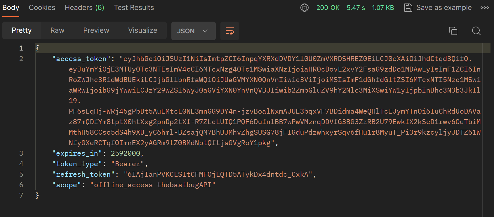

TheLastBugApp - Aplicación Backend

Esta es una aplicación backend desarrollada para abordar los requisitos de The Last Bug App. Proporciona funcionalidades como autenticación de usuarios y otras características esenciales para tu aplicación. La aplicacion fue desarrollada con .NET Core y Entity Framework. 

1- Instalación
Requisitos Previos:

Asegúrate de tener instalado .NET Core en tu sistema.

2 -Clonar el Repositorio:
git clone https://github.com/Sabrina2030/TheLastBugApp.git

3-Configuración de la Base de Datos:
- Se debe ejecutar un script SQL que se encuantra con el nombre de DB.sql
- La base de datos tiene el nombre de thelastbugdb
- Configura tu conexión a la base de datos en appsettings.json.

Uso

Una vez que la aplicación esté en funcionamiento, puedes acceder a las siguientes funcionalidades:

Autenticación de Usuario: Utiliza la página de login (/login) para autenticarte y obtener un token de acceso.

Endpoints Disponibles: Explora los distintos endpoints disponibles en la API para interactuar con la aplicación.

Ejemplos de Uso
Aquí algunos ejemplos básicos de cómo interactuar con la API:

Autenticación

curl --location 'http://localhost:5000/connect/token' \
--header 'Content-Type: application/x-www-form-urlencoded' \
--data-urlencode 'userName=pepe@gmail.com' \
--data-urlencode 'password=pepe1234' \
--data-urlencode 'grant_type=password' \
--data-urlencode 'client_id=TheLastBug'

Respuesta: 

Para el restos de los endpoints podra probarlos desde el swagger. 

http://localhost:5000/swagger/index.html

